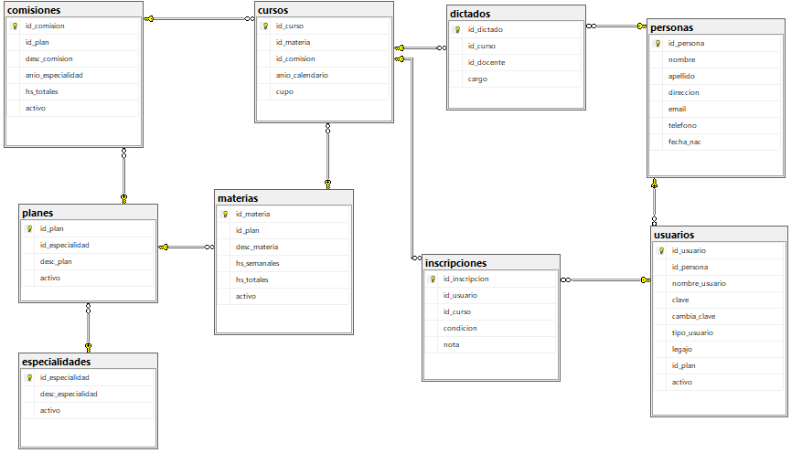
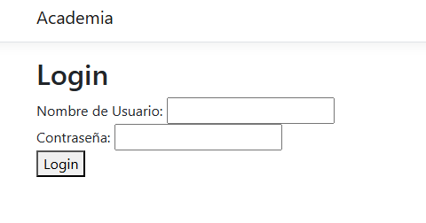
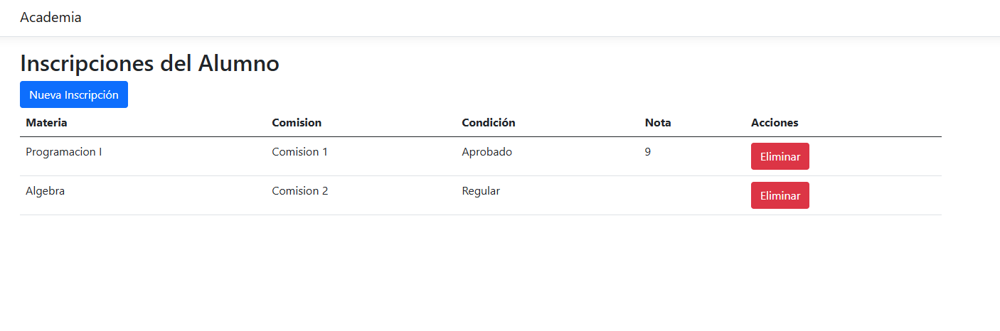
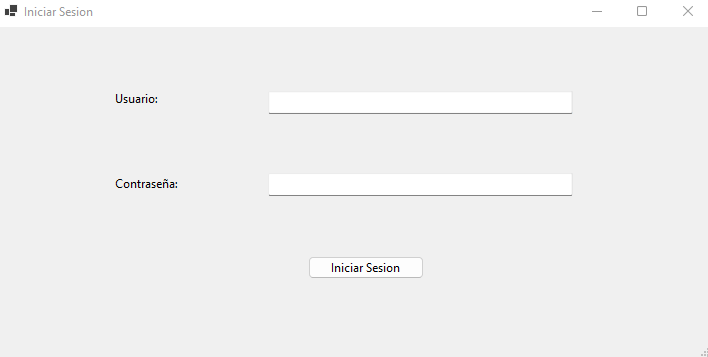
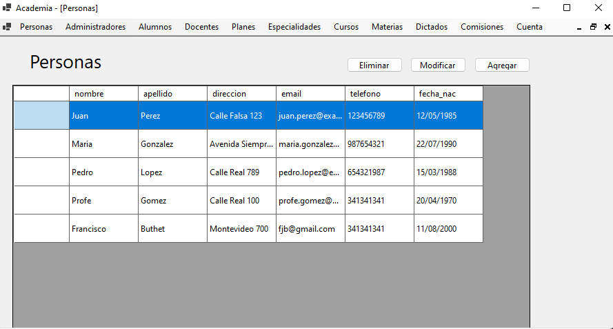
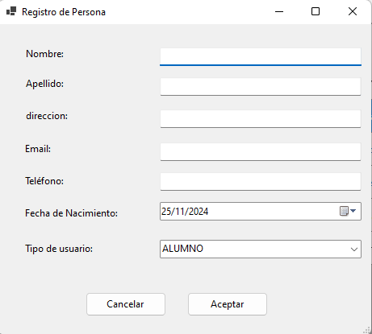
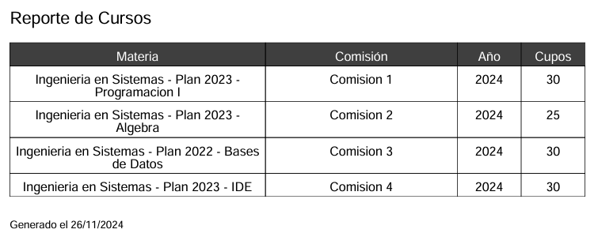

# Academia

> Sistema de gestión académica desarrollado en 2024 para la materia **Tecnologías de Desarrollo de Software IDE** de la carrera **Ingeniería en Sistemas de Información (UTN)**.

## Descripción

Academia es una aplicación diseñada para administrar los procesos académicos de una institución educativa. El sistema permite gestionar alumnos, docentes, cursos, materias, planes de estudio, especialidades e inscripciones, además de generar reportes y administrar usuarios mediante distintos niveles de acceso.

El proyecto fue desarrollado utilizando una arquitectura multicapa basada en .NET, incorporando una aplicación web, una aplicación de escritorio y una API para la comunicación entre capas.

---

## Modelo de Datos



---

## Características Principales

### Gestión Académica

- Administración de especialidades.
- Administración de planes de estudio.
- Gestión de materias.
- Gestión de comisiones.
- Gestión de cursos.
- Gestión de docentes.
- Gestión de alumnos.
- Gestión de personas.
- Gestión de asignaciones docentes.

### Inscripciones

- Inscripción de alumnos a cursos.
- Consulta de inscripciones.
- Gestión de estados académicos.

### Reportes

- Generación de reportes PDF.
- Consulta de información académica.

### Seguridad

- Autenticación de usuarios.
- Control de acceso basado en roles.
- Gestión de permisos según perfil.

---

## Roles del Sistema

### Administrador

Permite realizar operaciones de:

- Alta
- Baja
- Modificación
- Consulta

sobre las siguientes entidades:

- Especialidades
- Planes
- Materias
- Comisiones
- Docentes
- Alumnos
- Personas
- Cursos
- Dictados

### Alumno

- Inscripción a cursos.
- Baja de inscripciones.
- Consulta de inscripciones.

### Docente

- Consulta de inscripciones.
- Gestión de notas.
- Actualización de información académica relacionada con sus cursos.

---

## Arquitectura

La solución está compuesta por los siguientes proyectos:

### Domain

Contiene:

- Entidades del dominio.
- DTOs.
- Servicios.
- Reglas de negocio.

### ApiClient

Biblioteca responsable de la comunicación entre las capas de presentación y la lógica de negocio.

### Web.UI

Aplicación web destinada a docentes y alumnos.

Incluye:

- Inicio de sesión.
- Consulta de información académica.
- Gestión de inscripciones.
- Gestión de notas.

### WindowsForms

Aplicación de escritorio utilizada para tareas administrativas.

Incluye:

- Administración completa del sistema.
- Gestión de usuarios.
- Gestión académica.
- Generación de reportes.

---

## Tecnologías Utilizadas

| Tecnología                   | Descripción                     |
| ---------------------------- | ------------------------------- |
| C#                           | Lenguaje principal              |
| .NET 8                       | Framework de desarrollo         |
| ASP.NET Core                 | Desarrollo web                  |
| Windows Forms                | Aplicación de escritorio        |
| Entity Framework             | ORM para acceso a datos         |
| ADO.NET                      | Acceso directo a base de datos  |
| SQL Server                   | Motor de base de datos          |
| SQL Server Management Studio | Administración de base de datos |
| Swagger                      | Pruebas y documentación de API  |
| iTextSharp                   | Generación de reportes PDF      |
| Visual Studio 2022           | Entorno de desarrollo           |

---

## Capturas de Pantalla

### Modelo Web

#### Login



#### Portal Alumno



---

### Aplicación de Escritorio

#### Login



#### Panel de Administración



#### Registro de Personas



#### Reportes



---

## Instalación

### Requisitos

- .NET 8 SDK
- SQL Server
- Visual Studio 2022

### Clonar el repositorio

```bash
git clone https://github.com/sebastianuribarri/Academia.git
```

### Configurar la Base de Datos

1. Abrir SQL Server.
2. Ejecutar el script SQL incluido en el repositorio.
3. Configurar la cadena de conexión correspondiente.

### Ejecutar la Solución

1. Abrir `Academia.sln`.
2. Restaurar los paquetes NuGet.
3. Configurar los proyectos de inicio.
4. Ejecutar la solución desde Visual Studio.

---

## Aprendizajes

Durante el desarrollo de este proyecto se aplicaron conceptos relacionados con:

- Arquitectura multicapa.
- Diseño de aplicaciones empresariales.
- APIs REST.
- Persistencia de datos.
- Entity Framework y ADO.NET.
- Gestión de usuarios y permisos.
- Desarrollo de aplicaciones web y de escritorio.
- Trabajo colaborativo utilizando Git y GitHub.

---

## Equipo

- Francisco Buthet
- Sebastián Uribarri

---

## Contexto Académico

Trabajo Práctico Integrador desarrollado durante el año **2024** para la materia **Tecnologías de Desarrollo de Software IDE**, perteneciente a la carrera **Ingeniería en Sistemas de Información** de la **Universidad Tecnológica Nacional (UTN)**.
